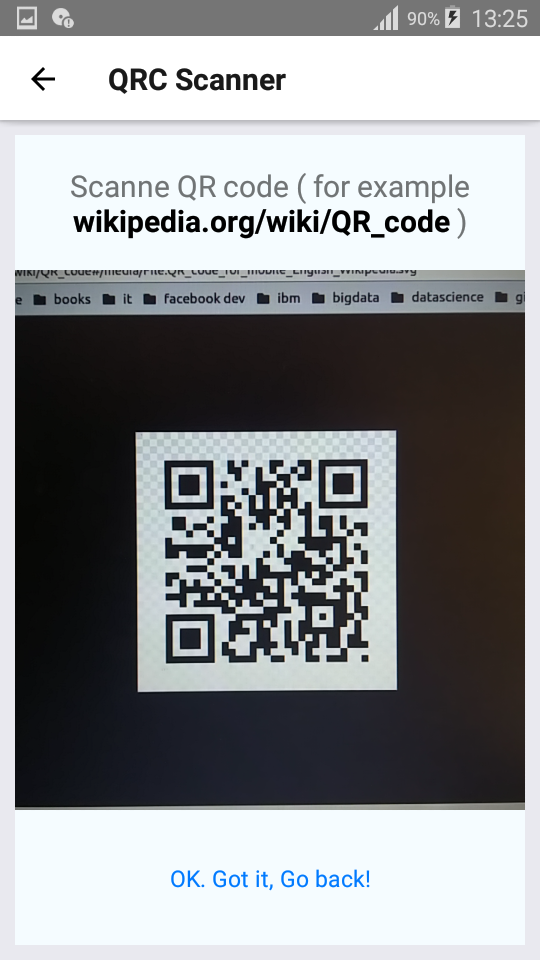

# React Native QR Code App Demo

!!Sorry, this repo code is outdated!!
Creating a React Native App in order to scan a QR code for a URL and open it via the default browser (tested for Android).

Main components :

- React Native.
- React Native Camera.
- React Native Navigation.

Demo :

[More screenshots](/screenshots).

## Creators

  Mohamed Aimane Skhairi
  skhairimedaimane@gmail.com

## License

This project is open-sourced software licensed under the [MIT License](https://opensource.org/licenses/MIT).
